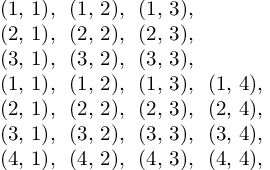
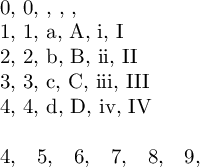

# LaTeX Examples

## Conditionals
```tex
\documentclass[varwidth]{standalone}
\usepackage{etoolbox}

\begin{document}
\newtoggle{a}
a is \iftoggle{a}{true}{false} \\
\toggletrue{a}
a is \iftoggle{a}{true}{false} \\
\togglefalse{a}
a is \iftoggle{a}{true}{false} \\

\newtoggle{b}
\toggletrue{a}
a is \ifboolexpr{togl{a}}{true}{false} \\
b is \ifboolexpr{togl{b}}{true}{false} \\
a and b is \ifboolexpr{togl{a} and togl{b}}{true}{false} \\
a or b is \ifboolexpr{togl{a} or togl{b}}{true}{false} \\
not a and not b is \ifboolexpr{not togl{a} or not togl{b}}{true}{false} \\

\newtoggle{c}
\togglefalse{a}
\togglefalse{b}
\togglefalse{c}
\whileboolexpr{not(togl{a} and togl{b} and togl{c})} {
  \iftoggle{a}{true}{false},
  \iftoggle{b}{true}{false},
  \iftoggle{c}{true}{false} \\
  \ifboolexpr{not togl{c}}{
    \toggletrue{c}
  }{\ifboolexpr{not togl{b}} {
    \toggletrue{b}
  }{
    \toggletrue{a}
  }}
}
\end{document}
```


## For Loops
```tex
\documentclass[varwidth]{standalone}
\usepackage{tikz}

\begin{document}
\foreach \x in {1, 2, 3}{
  \foreach \y in {1, 2, 3}{
    (\x, \y),
  }

}

\foreach \x in {1, ..., 4}{
  \foreach \y in {1, ..., 4}{
    (\x, \y),
  }

}
\end{document}
```


## Counters
```tex
\documentclass[varwidth]{standalone}
\usepackage{etoolbox}

\begin{document}
\newcounter{a}
\thea, \arabic{a}, \alph{a}, \Alph{a}, \roman{a}, \Roman{a} \\
\stepcounter{a}
\thea, \arabic{a}, \alph{a}, \Alph{a}, \roman{a}, \Roman{a} \\
\refstepcounter{a}
\thea, \arabic{a}, \alph{a}, \Alph{a}, \roman{a}, \Roman{a} \\
\addtocounter{a}{1}
\thea, \arabic{a}, \alph{a}, \Alph{a}, \roman{a}, \Roman{a} \\
\setcounter{a}{4}
\thea, \arabic{a}, \alph{a}, \Alph{a}, \roman{a}, \Roman{a} \\

\whileboolexpr{test {\ifnumcomp{\value{a}}{<}{10}}}{
  \arabic{a},
  \stepcounter{a}
}
\end{document}
```

